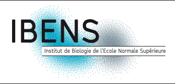
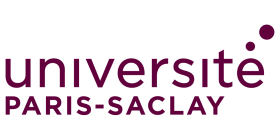
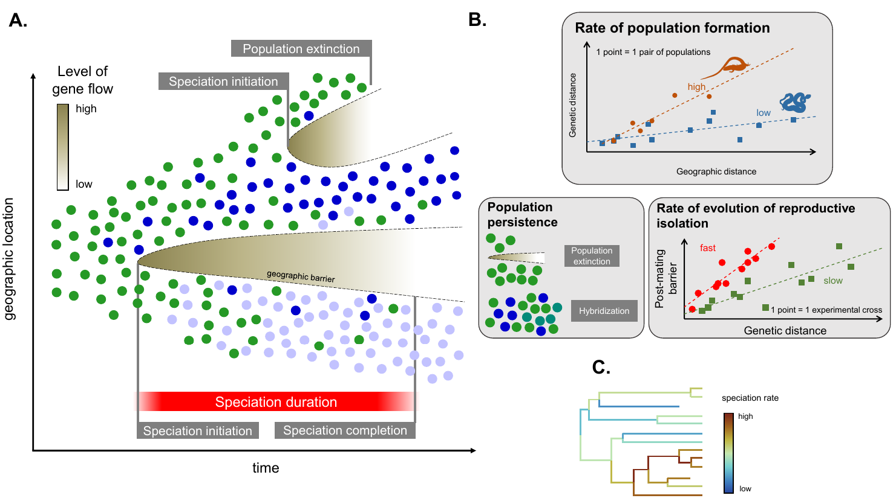
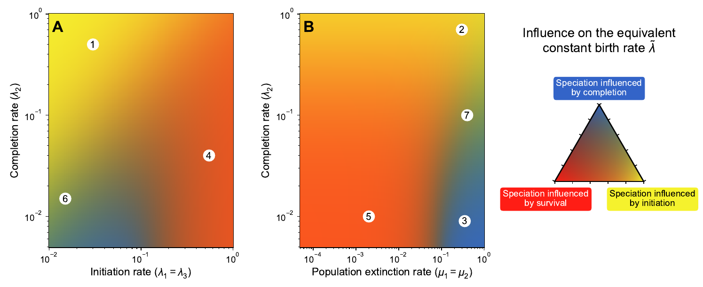

# Pierre Veron

   
   
   
    

[About](#about) · [My work](#my-work) · [Publications](#publications) · [Teaching](#teaching) · [Talks and posters](#talks-and-posters) · [Contact](#contact) · [Misc](#misc) · [CV](https://pierre-veron.github.io/docs/CV.pdf)

## About
I'm Pierre Veron, third year PhD student in evolution and ecology at Institute of Biology of École Normale Supérieure ([IBENS](https://www.ibens.ens.fr/)) and at Institute for the Diversity, Ecology and Evolution of the Living World of the Université Paris Saclay ([IDEEV](https://www.ideev.universite-paris-saclay.fr/en/)). 

I'm interested in speciation research, my work focuses on theoretical predictions on the link between microevolution and macroevolution. I'm co-supervised by 
* Hélène Morlon ([Biodiv team](https://www.phyloeco.bio.ens.psl.eu/))
* Tatiana Giraud ([Evolutionary Genetics and Ecology team](https://www.ese.universite-paris-saclay.fr/en/evolutionary-genetics-and-ecology/)).

   
   
    
   

My full résumé can be found [here](https://pierre-veron.github.io/docs/CV.pdf).

## My work 
I am working on modelisation of the different steps of speciation, with the aim to understand which microevolutionary processes modulate the rates of speciation in the living world. 

_Summary of the speciation steps and the most common ways to estimate them in the nature._

To do so I rely on a modelisation approach, for instance using the holey adaptive landscape to analyse the influence of the parameters such as population size, mutation rate, outbreeding depression on the time for speciation in allopatric or parapatric mode. 

Additionnaly, I work on more macroevolutionnary models such as the protracted birth death model of speciation (PBD) to analyse the most influent steps of speciation (population splitting, accumulation of reproductive isolation, population survival). 

_Most important steps of the speciation on the overall speciation rate._

## Publications
Veron, P., Andréoletti, J., Giraud, T., & Morlon, H. (2024). **Speciation completion rates have limited impact on macroevolutionary diversification**. _Philosophical Transactions of the Royal Society B, 380_, 20230317. doi: [10.1098/rstb.2023.0317](https://doi.org/10.1098/rstb.2023.0317) /  [PDF](docs/veron-et-al-2025-speciation-completion-rates-have-limited-impact-on-macroevolutionary-diversification.pdf) / [Sup. mat.](docs/PBD_analog_supp_mat.pdf)
 

Morlon, H., Andréoletti, J., Barido-Sottani, J., Lambert, S., Perez-Lamarque, B., Quintero, I., Senderov, V. and Veron, P. (2024). **Phylogenetic Insights into Diversification**. _Annual Review of Ecology, Evolution, and Systematics, 55_, 1–21. doi: [10.1146/annurev-ecolsys-102722-020508](https://doi.org/10.1146/annurev-ecolsys-102722-020508)
 

Veron, P., Rozanski, R., Marques, V., Joost, S., Deschez, M. E., Trenkel, V. M., Lorance, P., Valentini, A., Polanco, A. F., Pellissier, L., Eme, D. and Albouy, C. (2023). **Environmental DNA complements scientific trawling in surveys of marine fish biodiversity**. _ICES Journal of Marine Science, 80_(8), 2150–2165. doi: [10.1093/icesjms/fsad139](https://doi.org/10.1093/icesjms/fsad139) / [PDF](docs/Veron2023eDNA.pdf)
 

## Teaching 
### Adaptive dynamics
> Master 2 IMaLiS 2022 & 2023 | École normale supérieure - PSL, IBENS | Professor Régis Ferrière
>
> Adaptive dynamics modeling has become the dominant theoretical framework for "Darwinian ecology", i.e. the investigation of the ecological causes and consequences of evolution. The course will present the key concepts underlying the adaptive dynamics approach: environmental feedback loop, invasion fitness, evolutionary singularity, evolutionary stability, evolutionary branching, evolutionary suicide, pairwise invasibility plots and canonical equations. The general framework will be applied to study the eco-evolutionary dynamics of populations competing for resources, predator-prey interactions, and mutualistic systems. Hands-on tutorial sessions will aim at simulations of specific examples.

### Maths training for L3 and M1 students
> Master IMaLiS | École normale supérieure - PSL, IBENS | Professor Amaury Lambert 
> 
> The course covers differential equations, dynamical systems, elementary linear algebra, Markov chains, probabilities and statistics. The course website I created can be found [here](https://codimd.math.cnrs.fr/s/hmbX8GuA4#).

### Computational biology
> Licence 3 biology | École normale supérieure - PSL, IBENS | Professors Pierre Vincens and Morgane Thomas-Chollier
> 
>The aim of this course is to introduce students to bioinformatics, by consolidating their knowledge in fundamental principles, as well as opening to current research topics in computational biology.
>The course includes programming (`Python` and `R`) applied to biology, and courses with practicals in computational biology. The program covers:
> * knowledge of different data structures,
> * object-oriented programming (small course material),
> * modelling tools: random variables and Markov chains with Python, stochastic processes, numerical integration applied to biology (small course material),
> * introduction to biopython package for bioinformatics (small course material),
> * manipulation of databases using `panda`.
> * project of biostatistics in `R`

## Talks and posters 
* Journées IDEEV (Institut Diversité Écologie et Évolution du Vivant) - January, 13, 2025 - Université Paris-Saclay, Gif-sur-Yvette, France
* Seminar of ecology and evolution - December, 6, 2024 - IBENS Paris, France
* Stochastic Processes in Evolutionary Biology ([poster](https://hub.bio.ens.psl.eu/index.php/s/Kb8gWELjzJQapys/download/poster.pdf)) -  Mai, 20, 2024 - CIRM, Marseille, France
* Perspectives on speciation ([poster](https://hub.bio.ens.psl.eu/index.php/s/Kb8gWELjzJQapys/download/poster.pdf)) - April, 11, 2024 - London, UK
* École de printemps de la chaire MMB - June, 12, 2023 - Aussois, France
* Congrès des Jeunes Chercheur·e·s du Muséum - May 04, 2023 - Muséum National d'Histoire Naturelle, Paris, France
* Mathematical Population Dynamics, Ecology and Evolution (MPDEE 2023) - April 24, 2023 - CIRM, Marseille, France

## Contact 
📧 pveron [at] bio.ens.psl [dot] eu 

## Misc
* I am a member of the [MMB chair](http://www.cmap.polytechnique.fr/chaire-mmb/index.html), an interdisciplinary research group on the modelling and mathematics of biology, supported by the École polytechnique and the Muséum national d'histoire naturelle in Paris
* I'm interested in photography, my online portfolio can be found here: [https://pierreveron.myportfolio.com/](https://pierreveron.myportfolio.com/) 
* I have been co-organizing the [Astromaths](https://www.fondation-blaise-pascal.org/nos-actions/les-projets-de-la-fondation/le-camp-astromaths/) camp for several years, a summer school in astronomy in mathematics.  

---

Last update: 2025/03/07
