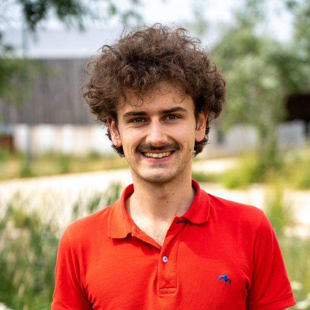
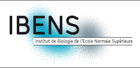
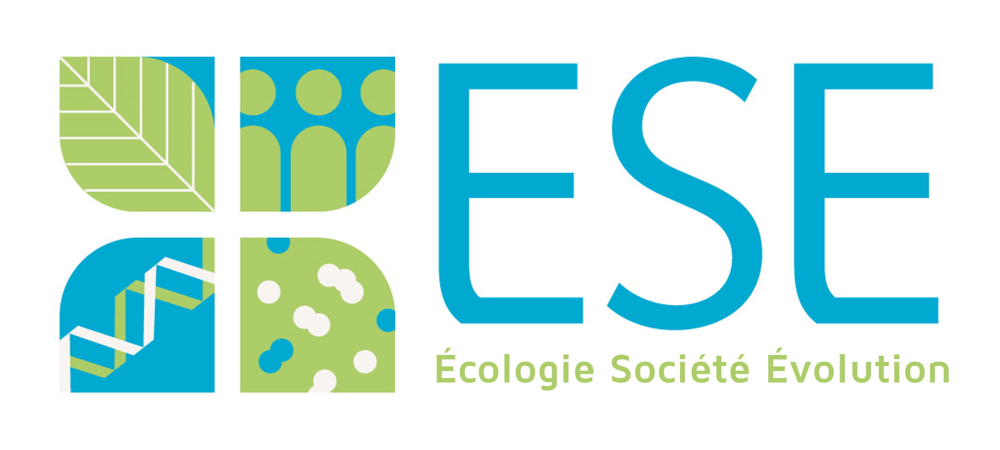
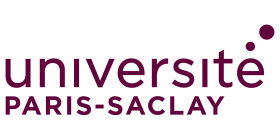
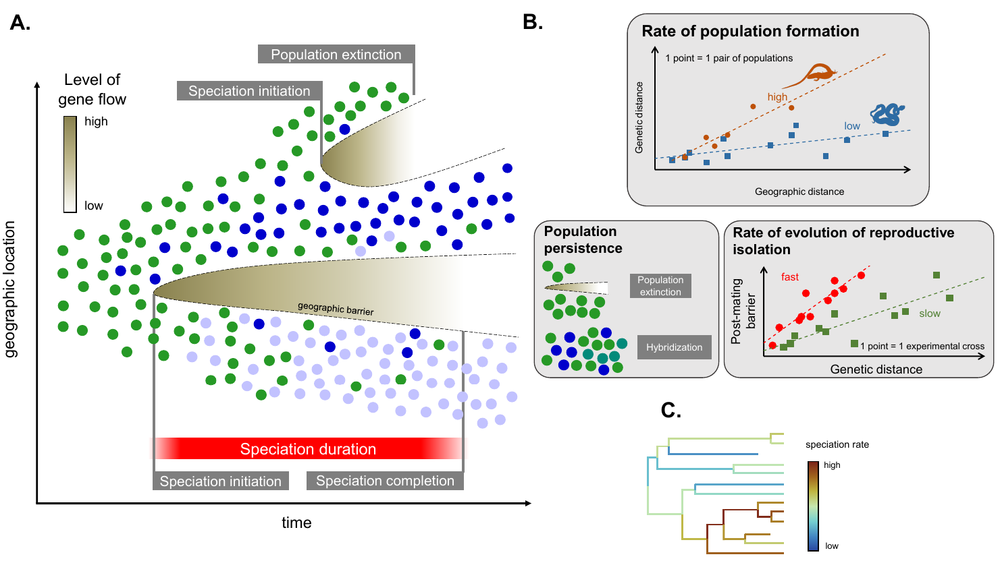
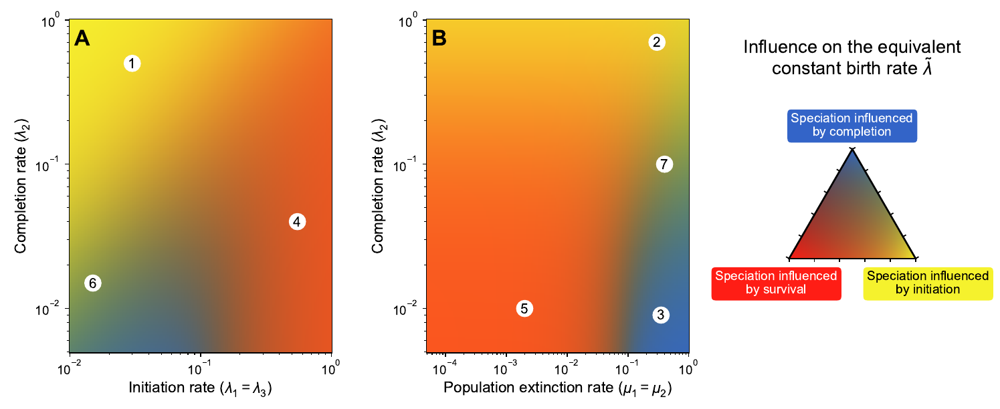

# Pierre Veron 
<table>
    <tr>
        <td>

   
   
   
    

        </td>
        <td>
            <a href="#about">👋 About</a> 
            <a href="#my-work">💻 My work</a> 
            <a href="#publications">📃 Publications</a> 
            <a href="#teaching">🧑‍🏫 Teaching</a> 
            <a href="#talks-and-posters">💬 Talks and posters</a> 
            <a href="#contact">📧 Contact</a> 
            <a href="#misc">ℹ️ Misc</a> 
            <a href="https://pierre-veron.github.io/docs/CV.pdf">🎓 CV</a> 
        </td>
    </tr>
</table>

## About
I'm Pierre Veron, PhD student in evolution and ecology at Institute of Biology of École Normale Supérieure ([IBENS](https://www.ibens.ens.fr/)) and at Institute for the Diversity, Ecology and Evolution of the Living World of the Université Paris Saclay ([IDEEV](https://www.ideev.universite-paris-saclay.fr/en/)). My PhD is funded by the [École polytechnique](https://www.polytechnique.edu/en) and the [Institut des Mathématiques pour la Planète Terre](https://impt.math.cnrs.fr/).

I'm interested in speciation research, my work focuses on theoretical predictions on the link between microevolution and macroevolution. I'm co-supervised by 
* Hélène Morlon ([Biodiv team](https://www.phyloeco.bio.ens.psl.eu/))
* Tatiana Giraud ([Evolutionary Genetics and Ecology team](https://www.ese.universite-paris-saclay.fr/en/evolutionary-genetics-and-ecology/)).

   
   
    
   

My full résumé can be found [here](https://pierre-veron.github.io/docs/CV.pdf).

## My work 
I am working on modelisation of the different steps of speciation, with the aim to understand which microevolutionary processes modulate the rates of speciation in the living world. 

_Summary of the speciation steps and the most common ways to estimate them in the nature._

To do so I rely on a modelisation approach, for instance using the holey adaptive landscape to analyse the influence of the parameters such as population size, mutation rate, outbreeding depression on the time for speciation in allopatric or parapatric mode. 

Additionnaly, I work on more macroevolutionnary models such as the protracted birth death model of speciation (PBD) to analyse the most influent steps of speciation (population splitting, accumulation of reproductive isolation, population survival). 

_Most important steps of the speciation on the overall speciation rate._

## Publications
Veron, P., Spire, A., Chave-Lucas, A., Giraud, T., & Morlon, H. (2026). **Rapid speciation in small populations challenges the dominance of ecological speciation**. _Preprint on bioRxiv_. doi: [10.64898/2026.02.19.706750](https://doi.org/10.64898/2026.02.19.706750) / [PDF](docs/Veron_et_al2026_Rapid_speciation_preprint.pdf)

Veron, P., Andréoletti, J., Giraud, T., & Morlon, H. (2024). **Speciation completion rates have limited impact on macroevolutionary diversification**. _Philosophical Transactions of the Royal Society B, 380_, 20230317. doi: [10.1098/rstb.2023.0317](https://doi.org/10.1098/rstb.2023.0317) /  [PDF](docs/veron-et-al-2025-speciation-completion-rates-have-limited-impact-on-macroevolutionary-diversification.pdf) / [Sup. mat.](docs/PBD_analog_supp_mat.pdf)
 

Morlon, H., Andréoletti, J., Barido-Sottani, J., Lambert, S., Perez-Lamarque, B., Quintero, I., Senderov, V. and Veron, P. (2024). **Phylogenetic Insights into Diversification**. _Annual Review of Ecology, Evolution, and Systematics, 55_, 1–21. doi: [10.1146/annurev-ecolsys-102722-020508](https://doi.org/10.1146/annurev-ecolsys-102722-020508)
 

Veron, P., Rozanski, R., Marques, V., Joost, S., Deschez, M. E., Trenkel, V. M., Lorance, P., Valentini, A., Polanco, A. F., Pellissier, L., Eme, D. and Albouy, C. (2023). **Environmental DNA complements scientific trawling in surveys of marine fish biodiversity**. _ICES Journal of Marine Science, 80_(8), 2150–2165. doi: [10.1093/icesjms/fsad139](https://doi.org/10.1093/icesjms/fsad139) / [PDF](docs/Veron2023eDNA.pdf) / [Sup. mat.](docs/Veron2023eDNA_suppmat.pdf)
 

## Teaching 
**2025 - 2026**
* **Statistics and ecology**, *exercises sessions* – Licence 2, Université Paris-Saclay. 
 
**2024 – 2025**
* **Adaptive dynamics**, *exercises sessions* – Master 2 IMaLiS*.
* **Maths training**, *courses* - L3 and M1 students*. The course covers differential equations, dynamical systems, elementary linear algebra, Markov chains, probabilities and statistics. The course website I created can be found [here](https://codimd.math.cnrs.fr/s/hmbX8GuA4#).
* **Open Science**, *projects* –  Licence 3*
* **Python for biologists**, *exercises sessions* – Licence 3*.

**2023 –  2024**
* **Adaptive dynamics**, *exercises sessions* –  Master 2 IMaLiS*.
* **Maths training**, *courses* –  L3 and M1 students*. 
* **Biostatistics**, *projects* –  Licence 3*.
* **Computational biology**, *exercises sessions* –  Licence 3*. 

**2022 –  2023**
* **Adaptive dynamics**, *exercises sessions* –  Master 2 IMaLiS*.
* **Computational biology**, *exercises sessions* –  Licence 3*. 

\* = course given at the biology department, École normale supérieure - PSL

## Talks and posters 
* A multidimensional view of speciation: bridging micro and macro-evolution, CNRS Conférence Jacques Monod (talk) - October 21, 2025 - Roscoff, France
* ESEB 2025 (talk and [poster](docs/Veron-et-al-2025-speciation-completion-rates_poster.pdf)) – August 17, 2025 – Barcelona, Spain 
* Congrès des Jeunes Chercheur·e·s du Muséum – May 16, 2025 – Muséum National d'Histoire Naturelle, Paris, France
* Journées IDEEV (Institut Diversité Écologie et Évolution du Vivant) – January 13, 2025 –  Université Paris-Saclay, Gif-sur-Yvette, France
* Seminar of ecology and evolution –  December, 6, 2024 –  IBENS Paris, France
* Stochastic Processes in Evolutionary Biology ([poster](https://hub.bio.ens.psl.eu/index.php/s/Kb8gWELjzJQapys/download/poster.pdf)) – May 20, 2024 –  CIRM, Marseille, France
* Perspectives on speciation ([poster](https://hub.bio.ens.psl.eu/index.php/s/Kb8gWELjzJQapys/download/poster.pdf)) – April 11, 2024 –  London, UK
* École de printemps de la chaire MMB – June 12, 2023 –  Aussois, France
* Congrès des Jeunes Chercheur·e·s du Muséum –  May 04, 2023 – Muséum National d'Histoire Naturelle, Paris, France
* Mathematical Population Dynamics, Ecology and Evolution (MPDEE 2023) – April 24, 2023 –  CIRM, Marseille, France

## Contact 
📧 pveron [at] bio.ens.psl [dot] eu 

## Misc
* I am a member of the [MMB chair](http://www.cmap.polytechnique.fr/chaire-mmb/index.html), an interdisciplinary research group on the modelling and mathematics of biology, supported by the École polytechnique and the Muséum national d'histoire naturelle in Paris
* I'm interested in photography, my online portfolio can be found here: [https://pierreveron.myportfolio.com/](https://pierreveron.myportfolio.com/) 
* I have been co-organizing the [Astromaths](https://www.fondation-blaise-pascal.org/nos-actions/les-projets-de-la-fondation/le-camp-astromaths/) camp for several years, a summer school in astronomy in mathematics.  

–

Last update: 2026/02/23. © Pierre Veron. Photo © Klára Hlavatá 2025.
